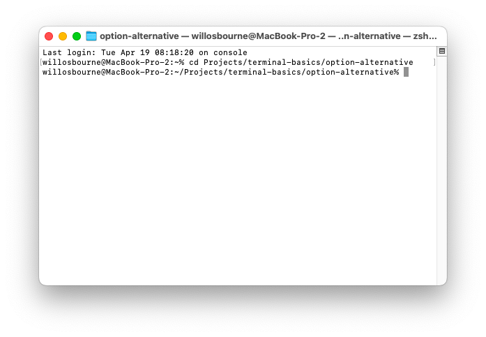
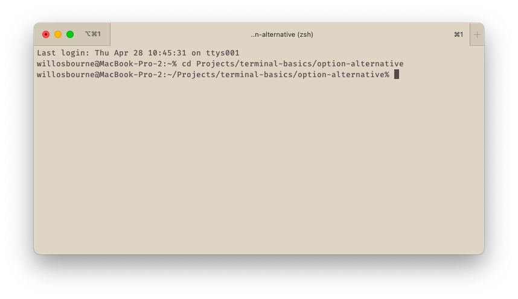
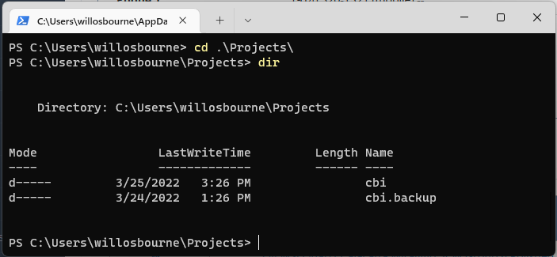
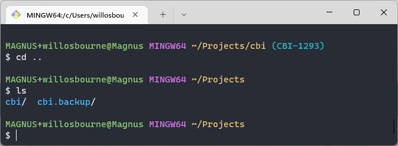
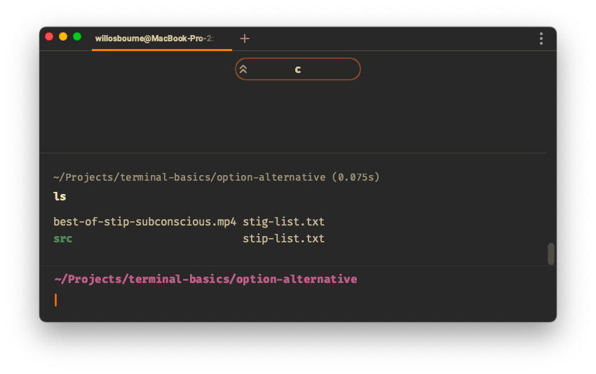
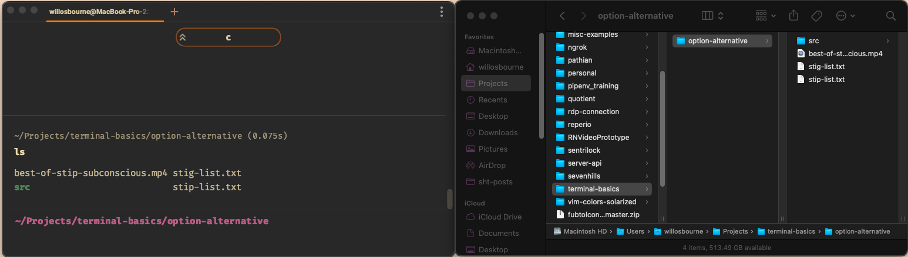
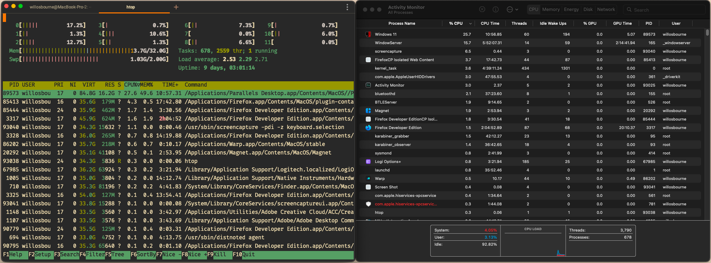
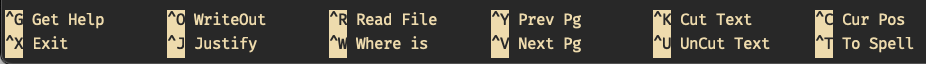
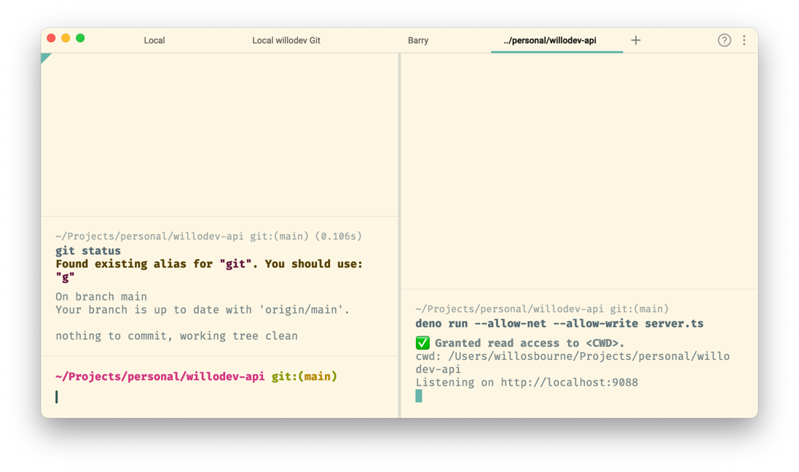
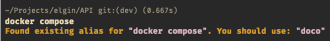

# Terminal Basics

_Originally written to accompany a Lunch & Learn talk given for
[Seven Hills Technology](https://sevenhillstechnology.com)._

## What is the Terminal
The terminal is essentially your computer, without a graphical interface on top of it.
You can run commands, start programs, view/copy/edit files, and more –
all from one place!

Terminals are also often called a CLI (Command Line Interface), which contrasts with a
GUI (Graphical User Interface).

You have a lot of options for what terminal you use, listed are a few you may use
or already be familiar with:

> Terminal.app


> iTerm2


> Windows PowerShell


> gitBash for Windows


> Warp


For the rest of this tutorial, you’ll be seeing Warp in examples. It's still in
active development & only available for MacOS right now, but it's a modern take on
a terminal, including a more intuitive text input field, clear blocking of commands,
and a command pallet similar to in VSCode.

#### A Note for Windows Users
This tutorial is done on MacOS with a `zsh` shell. Most (if not all) of it should be
compatible a `bash` shell which you can get on Windows using
[Windows Subsystem for Linux](https://docs.microsoft.com/en-us/windows/wsl/about)
(recommended if using a Windows laptop) or
[Git BASH for Windows](https://gitforwindows.org/) (recommended for Windows run
through a Virtual Machine). For anyone using a `bash` shell, the only differences
should be when you see a file similar to `.zshrc` in the tutorial, you will look for
a `.bashrc` file. This should also be called out where relevant.

Powershell and cmd.exe are CLIs designed for Windows and unless you want to convert
every guide you see online from `bash` to `powershell`, I recommend installing a bash
(or similar alternative) shell.

### CLI vs GUI
The CLI and GUI are just two different representations of what's happening on your
computer. For comparison, below is the terminal & file explorer showing the
contents of the same folder.



The terminal is more than just a text based file explorer, there’s also full programs
that run on the command line. Pictured below on the left is the command htop, which
is similar to Mac’s Activity Monitor (or Windows' Task Manager) to view &
manage active running processes.



### The Importance of Learning How to Use a Terminal
Whether you work front-end, back-end, mobile, or a mix, you will want to be
comfortable in a terminal for everything from managing packages, working with git,
and running your applications. You don’t have to be a complete wizard, but
understanding how to do your basic commands (and quickly) is an invaluable part of
being an efficient developer.

## Navigation
Learning to navigate your file system is the first thing you’ll need to do when you
open up your terminal, here are some of the basic commands

- `ls` - stands for “list” display your current directory’s contents
  - `ls -lah` - displays your directory’s contents in Long form (`-l`) to display things like ownership info, file size, and more, includes All (`-a`) your files, including hidden files & directories, the current & above directories, and the `-h` flag makes the files sizes more human-readable by including the unit suffix (ie Byte, Kilobyte, Megabyte, etc)
  - `.` - is your current directory
  - `..` - is the directory _containing_ or _above_ your current directory
- `cd` - stands for “change directory” changes your directory to the path you specify
  - `cd ..` - changes your directory to one directory above your current
- `mkdir` - stands for “make directory” creates a directory with the title of your input
- `rm` - stands for “remove” deletes a file
  - `rm -rf` - recursively & forcibly remove a directory and all its contents
  - **Note:** `rm` does not move a file to your trash, it deletes the file then & there. Be careful because if you rm something it is unrecoverable
  - Consider installing `trash` ([MacOS](https://formulae.brew.sh/formula/trash), [Linux](https://ofstack.com/Linux/29693/trash-cli:-command-line-recycle-bin-tool-on-linux.html)) to have a command to move a file to the trash rather than instantly deleting it
- `touch` - “touches” a file or directory. If the file does not exist, it will create it (helpful for creating files quickly, ie `touch README.md`)

## Command Usage
We’ve already gone over a few commands, and even some flags to modify them, but it's
good to understand the basic structure of a command. Lets breakdown the following
command

`mkdir -p src/colors/leisure`

The first thing we’ve typed is `mkdir`, which is the command we’re executing. Next,
`-p` is a flag modifying the command. In this example `-p` tells the `mkdir` command
to create _any_ directories between our current location required to reach the path
we specified (ie, `src` exists, `colors` and `leisure` do not, so it will create the
directory `colors`, then within that create the directory `leisure`). Finally, we
have the parameter we’re passing to the command `src/colors/leisure`. The command
needs to know the name / path of the directory its creating.

Each command will function a bit different, require different parameters, and have
different flags to alter them. Thankfully (virtually) every command comes with either
a `man` page (short for “manual”) or a `--help` / `-h` flag to tell you everything
you need to know about the command. Most baked-in bash commands like `mkdir` will
have a `man` page, but installed packages like `yarn` will not have a `man` page and
instead need to be passed the flag `-h` to view the help page.

> Try the following `man mkdir`, `mkdir -h`, `man yarn`, `yarn -h` to see examples of
> manual & help pages both working and not working (if you don’t have `yarn` try some
> other commands you may have installed to see if they have a manual or help page
> – `npm` has both!)

## Common Tasks
As a developer, there’s any number of common tasks that you can or will do in the CLI.
Anyone working with React, Angular, Node or any other number of JS libraries will be
familiar with `npm` or `yarn` as a package manager for managing dependencies. You’ve
probably also started a server with `npm start` or `dotnet run`. Understanding how
these commands are structured and being able to use the `man` or `--help` pages will
let you troubleshoot things easier & faster than having to search each thing.
Reading man pages will also show you things you may not have known you’ve needed
(such as ls -R 👀). If there are commands you use often in your day-to-day work,
check out what all it can do.

## Viewing & Editing Files
Viewing and editing files can be done quickly from the command line without having to
open them up in an IDE like VSCode. If you just want to view a file, you can try out
the `cat` or `less` commands. `cat` is an interesting one, because it's actually short
for “concatenate” and can be used to join together two files, outputs, etc. and pass
them along to something else, however if you just `cat` a file to nothing, it will
concatenate it to the output of the terminal, effectively printing the file contents.
If you have a larger file however, this can be a bit clunky. This is where the command
`less` comes in, as opening a file by going `less names.txt` opens it in an application
where you are able to scroll back & forth with `j` and `k` (or arrow keys) and do
helpful things like search for a word or pattern by hitting `/`.

> Fun Fact: The command `less` derives its name from an earlier command called `more`,
> which offered similar features, but `less` expanded upon them & made it more
> performant for larger files.
> 
> So sometimes `less` is `more`.

But what if you want to quickly edit a file, or have to amend a commit in git? Well
now you’ll need a Text Editor, but don’t worry, you still don’t have to leave the CLI!
There are plenty of options, from Vim to Emacs to Nano. Vim is the default for most
shells, so it's good to understand some basics of it, however Nano is significantly
more user-friendly, so we’ll go over the basics of that & how to set it as your main
text editor.

### Vim
> `<Esc> : q ! <Enter>`
> All you _need_ to know.

Vim is _my_ preferred CLI editor, but it has a reputation of being obtuse. Unless you
want to learn it, I’d recommend understanding the following concepts, then setting
your default editor to Nano.

- There are different “modes” to be in. You start in “command mode” and hitting `Esc` will get you back to it.
- To quit vim, hit `Esc` to enter command mode, hit `:` begin entering a command (look at the bottom of the window), and enter the command you would like to do:
  - `:wq` write (save) the file and quit vim
  - `:q` quit vim if no changes have been made
  - `:q!` quit vim and discard all changes – this is the “get me the hell out of vim” command
  - `:wq!` attempt to save change, but quit regardless of if save is successful
- If you don’t want to quit vim, from the command mode, you can hit i to enter “insert mode”. From here you can write what you need, navigating with arrow keys if needed, then hit `Esc` to return to command mode.
- To navigate the text in command mode, you can move the cursor using `h` `j` `k` `l` which correspond to the directions ⬅️⬇️⬆️➡️ 

### Nano

You can try out Nano by opening any text file with `nano file.txt` to get a feel for
it, but its very beginner-friendly for two main reasons

1. By default, your keyboard functions as normal, if you hit `h` an `h` is typed to the page where your cursor is.
2. The commands you need to save `^O` and quit `^X` are listed right at the bottom (the `^` character denotes the `ctrl` button)


To set nano as your default editor, just type the following into your console:

#### For zsh (MacOS)

```
echo 'export EDITOR=nano' >> ~/.zshrc
echo 'export VISUAL="$EDITOR"' >> ~/.zshrc
```

#### For bash (Linux)

```
echo 'export EDITOR=nano' >> ~/.bash_profile
echo 'export VISUAL="$EDITOR"' >> ~/.bash_profile
```

## Tips & Tricks
### Chaining Commands
Two powerful CLI operators are the `&&` (ampersands) and `|` (pipe) operators. The
`&&` operator tells the console “Do this command, then do this command.” That can
make simple things like installing all node packages & starting the development server
as easy as `npm install && npm run dev`, in one command. The `|` operator will take
the output of your previous command and _pipe_ or pass it to the next command.
For example if you have a JSON file you’d like to see in the console, and the `jq`
command installed, you can run `cat example.json | jq` to have it be printed to the
console in a formatted & highlighted fashion, regardless of if `example.json` is
formatted or a single line.

### Aliases
Aliases are an absolutely key part of a terminal not enough people take advantage of.
An alias lets you set a shortcut for commands you use frequently. Commonly repeated 
tasks like a git commit or starting a node server with a set of flags can be
streamlined to a few characters with an alias.

They can be set in the `~/.zshrc` or `~/.bashrc` file, and follow the following syntax:

```
alias gcm="git commit -m"
```

_Note:_ at the end of the article, I will include a list of aliases & other
configurations that may be a useful place to start, but I always found that adding
aliases just when I need them helps me use / remember them more.

### Tabs & Tiles
Most modern terminal applications have support for multiple tabs or tiling the window.
Taking advantage of this, as well as renaming tabs where relevant, can help your 
terminal experience be more organized and easier to manage. 

As an example, a common use case could be running a pane to handle git changes,
while having another pane for leaving the server running and monitoring logs.


## Conclusion
The terminal can be powerful and useful, if you're willing to spend a bit of time to
learn it & get comfortable with it. 

# Terminal Suggestions

Quick cheat sheet of things I'd recommend

## Good Terminals
- [iTerm2](https://iterm2.com/)
- [Warp (the one I use)](https://www.warp.dev/)
- [Hyper](https://hyper.is/)

## Helpful Terminal Commands / Plugins
- [Trash-CLI](https://formulae.brew.sh/formula/trash-cli) - lets you use `trash` instead of `rm` to remove files / folders in a non-permenant fashion
- [z](https://github.com/agkozak/zsh-z) - a frecent (frequent + recent) search to let you jump between directories quicker
- [you-should-use](https://github.com/MichaelAquilina/zsh-you-should-use) - a zsh plug in that will tell you if you used a full command when you have an alias existing for it



## Aliases & Functions

As a reminder, these go in your `~/.zshrc` or `~/.bashrc`

### Personal Faves
```
# Git Aliases
alias gco="git checkout"
alias gd="git diff"
alias gds="git diff --staged"
alias gl="git log --all --graph --format=\"%C(yellow)%h %C(green)[%ai|%an]%C(reset)%C(auto)%d %s\""
alias gp="git push"
alias gpl="git pull;"
alias gst="git status;"
alias gcm="git commit -m"
alias gmne="git commit --amend --no-edit"
alias gpuo="git push -u origin"
alias gcob="git checkout -b"
alias gcol="git checkout -"
alias gap="c; git status; git add --patch"

# Git functions
gdh() {
  git diff HEAD~"$1" HEAD
}

# other
alias c="clear;"
alias ll="ls -lah"
alias uuid="uuidgen | pbcopy"
alias doco="docker compose"
alias dl="docker compose logs -f --tail=0"
alias drl="docker compose restart; docker-compose logs -f --tail=0"
alias dul="docker compose up -d; docker-compose logs -f --tail=0"

# shows what process is running on a port
portlook() {
  netstat -vanp tcp | grep -E 'Proto|'$1
}

# open bash terminal of a docker container
dterm() {
  docker exec -it "$1" /bin/bash
}
```
